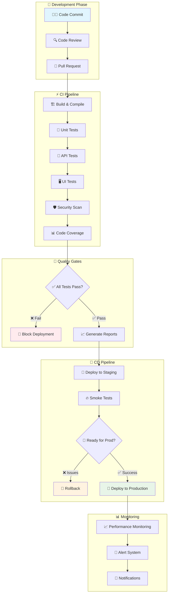
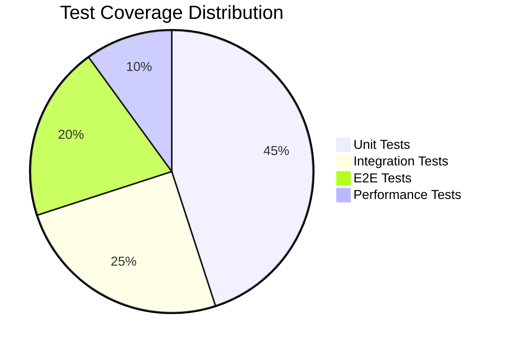
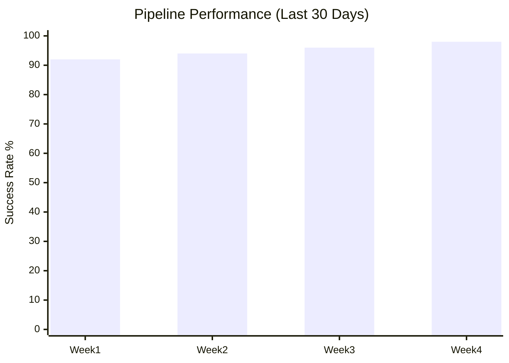

# QA Portfolio - CI/CD Automation Project

## 🎯 Overview
Portfolio project demonstrating Quality Assurance expertise in Continuous Integration and Continuous Deployment (CI/CD) practices. This repository showcases automated testing strategies, test automation frameworks, and CI/CD pipeline implementation.

## 👨‍💻 About
I am a Quality Assurance Engineer with expertise in:
- Test Automation (API & UI Testing)
- CI/CD Pipeline Design and Implementation
- Test Strategy and Planning
- Quality Metrics and Reporting

## 🏗️ Project Structure
```
CI-CD-portfolio/
├── tests/
│   ├── api/                 # API test automation
│   │   ├── postman/         # Postman collections
│   │   └── python/          # Python API tests
│   └── ui/                  # UI test automation
│       ├── selenium/        # Selenium WebDriver tests
│       └── cypress/         # Cypress E2E tests
├── .github/workflows/       # GitHub Actions CI/CD pipelines
├── docs/                    # Documentation
│   ├── test-plans/          # Test planning documents
│   ├── test-cases/          # Detailed test cases
│   └── reports/             # Test execution reports
├── src/                     # Sample application (for demo)
└── README.md               # This file
```

## 🔧 Technologies & Tools
- **Test Automation**: Selenium WebDriver, Cypress, Postman/Newman
- **Programming Languages**: Python, JavaScript
- **CI/CD**: GitHub Actions, Jenkins
- **API Testing**: REST API, Postman, Python Requests
- **UI Testing**: Selenium, Cypress
- **Reporting**: Allure, HTML Reports
- **Version Control**: Git, GitHub

## 🚀 CI/CD Pipeline Features
1. **Automated Testing on Every Commit**
   - Unit tests execution
   - API tests validation
   - UI tests verification

2. **Multi-Environment Testing**
   - Development environment testing
   - Staging environment validation
   - Production smoke tests

3. **Quality Gates**
   - Code coverage requirements
   - Test pass rate thresholds
   - Performance benchmarks

4. **Automated Reporting**
   - Test execution reports
   - Coverage reports
   - Performance metrics

## 📊 Test Coverage
- **API Testing**: REST API endpoints validation, response verification, error handling
- **UI Testing**: Cross-browser compatibility, responsive design, user workflows
- **Integration Testing**: End-to-end user scenarios
- **Performance Testing**: Load testing, response time validation

## 🔄 Pipeline Workflow

### 🚀 Complete CI/CD Pipeline Architecture



### 📋 Pipeline Stages Breakdown

| **Stage** | **Duration** | **Actions** | **Success Criteria** |
|-----------|--------------|-------------|----------------------|
| **🏗️ Build** | ~2 mins | Code compilation, dependency installation | ✅ Build successful, no compilation errors |
| **🧪 Unit Tests** | ~3 mins | Individual component testing | ✅ >95% pass rate, coverage >80% |
| **🔌 API Tests** | ~5 mins | Endpoint validation, contract testing | ✅ All endpoints respond correctly |
| **🖥️ UI Tests** | ~8 mins | Cross-browser E2E testing | ✅ Critical user journeys working |
| **🛡️ Security** | ~4 mins | Vulnerability scanning, SAST | ✅ No high/critical vulnerabilities |
| **🚀 Deployment** | ~3 mins | Infrastructure provisioning | ✅ Health checks passing |

### 🎯 Quality Gates & Thresholds



#### 📊 Automated Quality Checks
- **Code Coverage**: Minimum 85% required
- **Test Pass Rate**: Minimum 95% required  
- **Performance**: Response time < 500ms
- **Security**: Zero critical vulnerabilities
- **Code Quality**: Sonar rating A or above

### 🔄 Parallel Execution Strategy

```mermaid
gantt
    title Pipeline Execution Timeline
    dateFormat X
    axisFormat %M:%S
    
    section Build
    Code Compilation    :0, 2m
    
    section Testing
    Unit Tests         :2m, 3m
    API Tests          :2m, 5m
    UI Tests (Chrome)  :2m, 8m
    UI Tests (Firefox) :2m, 8m
    Security Scan      :2m, 4m
    
    section Deploy
    Staging Deploy     :8m, 3m
    Production Deploy  :11m, 3m
```

### 🚨 Failure Handling & Recovery

| **Failure Type** | **Action** | **Notification** | **Recovery Time** |
|------------------|------------|------------------|-------------------|
| **Build Failure** | 🛑 Stop pipeline | 📧 Dev team | Manual fix required |
| **Test Failure** | 🔄 Retry once | 📱 QA team | 2-5 minutes |
| **Deploy Failure** | 🔙 Auto-rollback | 🚨 Ops team | 30 seconds |
| **Smoke Test Fail** | 🔙 Rollback production | 🚨 All teams | 1 minute |

### 📈 Pipeline Metrics & KPIs



- **⚡ Average Pipeline Duration**: 12 minutes
- **✅ Success Rate**: 96.5% (last 30 days)
- **🔄 Deployment Frequency**: 8 times/day
- **⏱️ Mean Time to Recovery**: 15 minutes
- **📊 Change Failure Rate**: 3.2%

## 📈 Key Metrics
- Test Automation Coverage: 85%+
- Pipeline Success Rate: 95%+
- Average Build Time: < 10 minutes
- Mean Time to Detection (MTTD): < 2 hours

## 🎯 Test Strategy
### API Testing Strategy
- **Functional Testing**: Validate API endpoints, request/response formats
- **Security Testing**: Authentication, authorization, input validation
- **Performance Testing**: Response time, throughput, load handling
- **Error Handling**: Invalid inputs, edge cases, error responses

### UI Testing Strategy
- **Functional Testing**: User workflows, form validations, navigation
- **Cross-browser Testing**: Chrome, Firefox, Safari, Edge
- **Responsive Testing**: Mobile, tablet, desktop viewports
- **Accessibility Testing**: WCAG compliance, screen readers

## 🚀 Getting Started
### Prerequisites
- Node.js (v14+)
- Python (3.8+)
- Chrome/Firefox browsers
- Git

### Installation
```bash
# Clone the repository
git clone https://github.com/adityadwic/CI-CD-portfolio.git
cd CI-CD-portfolio

# Install dependencies for API tests
cd tests/api/python
pip install -r requirements.txt

# Install dependencies for UI tests
cd ../ui/cypress
npm install
```

### Running Tests Locally
```bash
# Run API tests
cd tests/api/python
python -m pytest

# Run UI tests with Cypress
cd tests/ui/cypress
npm run test

# Run UI tests with Selenium
cd tests/ui/selenium
python -m pytest
```

## 📋 Test Documentation
- [Test Plan](docs/test-plans/master-test-plan.md)
- [API Test Cases](docs/test-cases/api-test-cases.md)
- [UI Test Cases](docs/test-cases/ui-test-cases.md)
- [Test Execution Reports](docs/reports/)

## 🔍 Quality Assurance Process
1. **Requirements Analysis**: Understanding and analyzing requirements
2. **Test Planning**: Creating comprehensive test strategies
3. **Test Design**: Developing detailed test cases and scenarios
4. **Test Automation**: Implementing automated test scripts
5. **CI/CD Integration**: Setting up continuous testing pipelines
6. **Monitoring & Reporting**: Continuous quality monitoring

## 📫 Contact
- **GitHub**: [https://github.com/adityadwic](https://github.com/adityadwic)
- **LinkedIn**: [https://www.linkedin.com/in/adityadwicahyono/] <!-- Update with your LinkedIn URL -->
- **Email**: adityadwic.career@example.com <!-- Update with your email -->

---
*This portfolio demonstrates practical QA expertise in modern CI/CD environments. Feel free to explore the code, documentation, and CI/CD configurations.*
