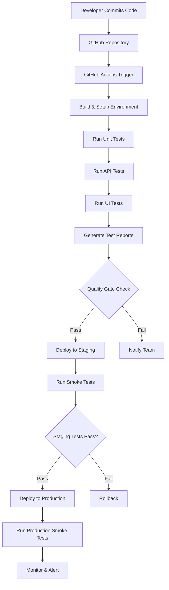

# CI/CD Pipeline Documentation

## Overview
This document describes the CI/CD pipeline implementation for the QA Portfolio project, demonstrating modern DevOps practices and automated testing strategies.

## Pipeline Architecture



## Pipeline Stages

### 1. Code Commit & Trigger
- **Trigger Events**: Push to main/develop branches, Pull Requests
- **Repository**: GitHub repository with branch protection rules
- **Webhook**: Automatic pipeline trigger on code changes

### 2. Build & Environment Setup
- **OS**: Ubuntu latest
- **Python**: Version 3.9 setup
- **Node.js**: Version 16 setup
- **Dependencies**: Automatic installation of test frameworks

### 3. Test Execution Stages

#### API Testing Stage
- **Framework**: Python + Pytest
- **Target**: JSONPlaceholder API endpoints
- **Duration**: ~2-3 minutes
- **Reports**: JUnit XML + HTML reports
- **Coverage**: All CRUD operations, error handling

#### UI Testing Stage
- **Selenium Tests**:
  - Framework: Selenium WebDriver + Python
  - Browser: Chrome (headless)
  - Duration: ~5-7 minutes
  - Coverage: Cross-browser compatibility, responsive design
  
- **Cypress Tests**:
  - Framework: Cypress
  - Browser: Chrome/Firefox
  - Duration: ~3-5 minutes
  - Coverage: E2E user workflows, API integration

### 4. Quality Gates

#### Automated Quality Checks
- **Test Pass Rate**: Minimum 95%
- **Build Success**: All stages must complete successfully
- **Performance**: Response times within acceptable limits
- **Security**: Basic security validations

#### Quality Metrics
- **Code Coverage**: Target 85%+
- **Test Reliability**: <5% flaky test rate
- **Pipeline Success Rate**: >95%
- **Mean Time to Detection**: <2 hours

### 5. Deployment Strategy

#### Staging Deployment
- **Environment**: Dedicated staging environment
- **Process**: Automated deployment after quality gates
- **Validation**: Smoke tests + regression testing
- **Rollback**: Automatic rollback on failure

#### Production Deployment
- **Environment**: Production environment
- **Process**: Manual approval + automated deployment
- **Validation**: Production smoke tests
- **Monitoring**: Real-time health checks

## GitHub Actions Workflow

### Workflow File Structure
```yaml
.github/workflows/
├── ci-cd-pipeline.yml     # Main CI/CD pipeline
├── nightly-tests.yml      # Scheduled regression tests
├── security-scan.yml      # Security vulnerability scans
└── performance-tests.yml  # Performance testing pipeline
```

### Job Dependencies
```
api-tests ──┐
            ├─→ quality-gate ──→ deploy
ui-tests ───┘
```

### Parallel Execution
- API and UI tests run in parallel for faster feedback
- Multiple test suites can execute simultaneously
- Resource optimization for efficient pipeline execution

## Environment Configuration

### Development Environment
- **Purpose**: Local development and testing
- **Data**: Mock data and test fixtures
- **Access**: Developer workstations

### Staging Environment
- **Purpose**: Pre-production validation
- **Data**: Production-like test data
- **Access**: QA team and stakeholders

### Production Environment
- **Purpose**: Live application
- **Data**: Real production data
- **Access**: End users

## Test Data Management

### API Test Data
- **Static Data**: Fixed test datasets for consistent results
- **Dynamic Data**: Generated test data for varied scenarios
- **Cleanup**: Automatic cleanup after test execution

### UI Test Data
- **Test Users**: Dedicated test accounts
- **Test Scenarios**: Predefined user workflows
- **Data Isolation**: Tests don't interfere with each other

## Reporting & Notifications

### Test Reports
- **HTML Reports**: Detailed test execution results
- **JUnit XML**: Machine-readable format for CI/CD integration
- **Screenshots**: Captured on test failures (UI tests)
- **Videos**: Recorded test execution (Cypress)

### Notifications
- **Slack Integration**: Real-time notifications to team channels
- **Email Alerts**: Critical failure notifications
- **GitHub Comments**: PR status updates
- **Dashboard**: Real-time pipeline status

## Monitoring & Metrics

### Pipeline Metrics
- **Build Duration**: Average pipeline execution time
- **Success Rate**: Percentage of successful pipeline runs
- **Test Coverage**: Code coverage percentage
- **Failure Trends**: Historical failure analysis

### Quality Metrics
- **Defect Escape Rate**: Production bugs not caught in testing
- **Test Effectiveness**: Bugs found vs. bugs escaped
- **Mean Time to Recovery**: Time to fix broken builds
- **Test Maintenance**: Time spent maintaining tests

## Best Practices Implemented

### 1. Pipeline Design
- **Fast Feedback**: Quick feedback to developers
- **Fail Fast**: Early detection of issues
- **Parallel Execution**: Optimal resource utilization
- **Idempotent**: Repeatable pipeline execution

### 2. Test Strategy
- **Test Pyramid**: Balanced test distribution
- **Risk-Based Testing**: Focus on critical functionality
- **Data-Driven Testing**: Parameterized test execution
- **Continuous Testing**: Tests at every stage

### 3. Quality Assurance
- **Quality Gates**: Mandatory quality checks
- **Traceability**: Link tests to requirements
- **Coverage Analysis**: Comprehensive test coverage
- **Performance Testing**: Non-functional testing

### 4. DevOps Integration
- **Infrastructure as Code**: Version-controlled configurations
- **Automated Deployment**: Consistent deployment process
- **Monitoring**: Continuous application monitoring
- **Feedback Loops**: Continuous improvement process

## Troubleshooting Guide

### Common Issues

#### Pipeline Failures
- **Test Failures**: Check test logs and reports
- **Environment Issues**: Verify environment setup
- **Dependency Problems**: Update dependency versions
- **Network Issues**: Check external service availability

#### Performance Issues
- **Slow Tests**: Optimize test execution
- **Resource Constraints**: Scale pipeline resources
- **Timeout Issues**: Adjust timeout configurations
- **Flaky Tests**: Stabilize unreliable tests

### Debugging Steps
1. **Check Pipeline Logs**: Review detailed execution logs
2. **Verify Environment**: Ensure environment consistency
3. **Run Tests Locally**: Reproduce issues locally
4. **Check Dependencies**: Verify all dependencies are available
5. **Review Changes**: Analyze recent code changes

## Security Considerations

### Pipeline Security
- **Secret Management**: Secure storage of credentials
- **Access Control**: Role-based access to pipeline
- **Audit Logging**: Track all pipeline activities
- **Vulnerability Scanning**: Regular security scans

### Test Security
- **Data Protection**: Secure handling of test data
- **Environment Isolation**: Separate test environments
- **Credential Rotation**: Regular credential updates
- **Security Testing**: Include security test cases

## Future Enhancements

### Planned Improvements
- **Advanced Reporting**: Enhanced test analytics
- **Performance Testing**: Comprehensive performance suite
- **Security Testing**: Automated security testing
- **Mobile Testing**: Mobile application testing
- **API Contract Testing**: Consumer-driven contract testing

### Automation Expansion
- **Test Generation**: Automatic test case generation
- **Self-Healing Tests**: Auto-fixing flaky tests
- **Intelligent Test Selection**: Smart test execution
- **Predictive Analytics**: Failure prediction models

---

**Document Information:**
- Version: 1.0
- Created: September 2025
- Author: QA Engineer
- Review Date: Monthly
