# Master Test Plan - QA Portfolio CI/CD Project

## 1. Introduction

### 1.1 Purpose
This document outlines the comprehensive testing strategy for the QA Portfolio CI/CD project, demonstrating modern QA practices in continuous integration and deployment environments.

### 1.2 Scope
The test plan covers:
- API testing automation
- UI testing automation  
- CI/CD pipeline validation
- Cross-browser compatibility
- Performance testing
- Security testing considerations

### 1.3 Objectives
- Demonstrate QA expertise in automated testing
- Showcase CI/CD integration capabilities
- Validate API and UI functionality
- Ensure consistent quality across deployments
- Maintain high test coverage (85%+)

## 2. Test Strategy

### 2.1 Testing Approach
- **Shift-Left Testing**: Early integration of testing in development cycle
- **Pyramid Testing**: Unit tests (foundation) → API tests → UI tests
- **Risk-Based Testing**: Focus on critical paths and high-risk areas
- **Continuous Testing**: Automated tests in CI/CD pipeline

### 2.2 Test Types

#### 2.2.1 API Testing
- **Functional Testing**: Endpoint validation, CRUD operations
- **Contract Testing**: Request/response schema validation
- **Security Testing**: Authentication, authorization, input validation
- **Performance Testing**: Response time, throughput
- **Error Handling**: Invalid inputs, edge cases

#### 2.2.2 UI Testing
- **Functional Testing**: User workflows, form validations
- **Cross-Browser Testing**: Chrome, Firefox, Safari, Edge
- **Responsive Testing**: Mobile, tablet, desktop
- **Accessibility Testing**: WCAG 2.1 compliance
- **Visual Regression**: Layout and styling consistency

#### 2.2.3 Integration Testing
- **End-to-End Testing**: Complete user scenarios
- **API-UI Integration**: Data flow validation
- **Third-Party Integration**: External service connectivity

## 3. Test Environment

### 3.1 Test Environments
- **Development**: Local development testing
- **Staging**: Pre-production validation
- **Production**: Smoke tests and monitoring

### 3.2 Test Data Management
- **Static Test Data**: Fixed datasets for consistent testing
- **Dynamic Test Data**: Generated data for varied scenarios
- **Data Privacy**: No production data in test environments

## 4. Test Automation Framework

### 4.1 API Testing Tools
- **Python + Pytest**: Core testing framework
- **Requests Library**: HTTP client for API calls
- **Postman/Newman**: Collection-based testing
- **JSONSchema**: Response validation

### 4.2 UI Testing Tools
- **Selenium WebDriver**: Cross-browser automation
- **Cypress**: Modern E2E testing framework
- **WebDriver Manager**: Automatic driver management

### 4.3 CI/CD Integration
- **GitHub Actions**: Automated pipeline execution
- **Test Reporting**: HTML and XML reports
- **Artifact Management**: Test result storage

## 5. Test Execution

### 5.1 Automated Test Execution

```mermaid
graph LR
    A[Code Commit] --> B[Trigger Pipeline]
    B --> C[Build Application]
    C --> D[Unit Tests]
    D --> E[API Tests]
    E --> F[UI Tests]
    F --> G[Generate Reports]
    G --> H[Quality Gate]
    H --> I[Deploy to Staging]
    I --> J[Smoke Tests]
    J --> K[Deploy to Production]
```

### 5.2 Test Scheduling
- **On Every Commit**: Unit and API tests
- **Nightly**: Full regression suite
- **Weekly**: Performance and security tests
- **Release**: Complete test suite validation

## 6. Quality Metrics

### 6.1 Key Performance Indicators (KPIs)
- **Test Coverage**: Target 85%+
- **Pass Rate**: Target 95%+
- **Build Success Rate**: Target 95%+
- **Mean Time to Detection (MTTD)**: < 2 hours
- **Mean Time to Resolution (MTTR)**: < 4 hours

### 6.2 Quality Gates
- All critical tests must pass
- No high-severity bugs
- Performance thresholds met
- Security scans completed

## 7. Risk Management

### 7.1 Testing Risks
- **Environment Availability**: Backup environments ready
- **Test Data Dependencies**: Isolated test datasets
- **Tool Dependencies**: Version pinning and fallbacks
- **Flaky Tests**: Regular maintenance and review

### 7.2 Mitigation Strategies
- Regular test maintenance
- Comprehensive logging
- Parallel test execution
- Automatic retry mechanisms

## 8. Test Deliverables

### 8.1 Documentation
- Test plans and strategies
- Test case documentation
- Execution reports
- Defect reports

### 8.2 Automation Assets
- Test scripts and frameworks
- CI/CD pipeline configurations
- Test data and fixtures
- Utility libraries and helpers

## 9. Success Criteria

### 9.1 Project Success Metrics
- All planned test cases automated
- CI/CD pipeline fully functional
- Quality gates implemented
- Documentation complete
- Knowledge transfer completed

### 9.2 Quality Benchmarks
- Zero critical bugs in production
- Sub-10 minute pipeline execution
- 99% uptime in test environments
- Comprehensive test coverage

## 10. Maintenance and Support

### 10.1 Ongoing Activities
- Regular test script updates
- Framework version upgrades
- Performance optimization
- New feature test coverage

### 10.2 Review Schedule
- **Weekly**: Test results review
- **Monthly**: Framework assessment
- **Quarterly**: Strategy evaluation
- **Annually**: Complete plan review

---

**Document Information:**
- Version: 1.0
- Created: September 2025
- Author: QA Engineer
- Review Date: Monthly
